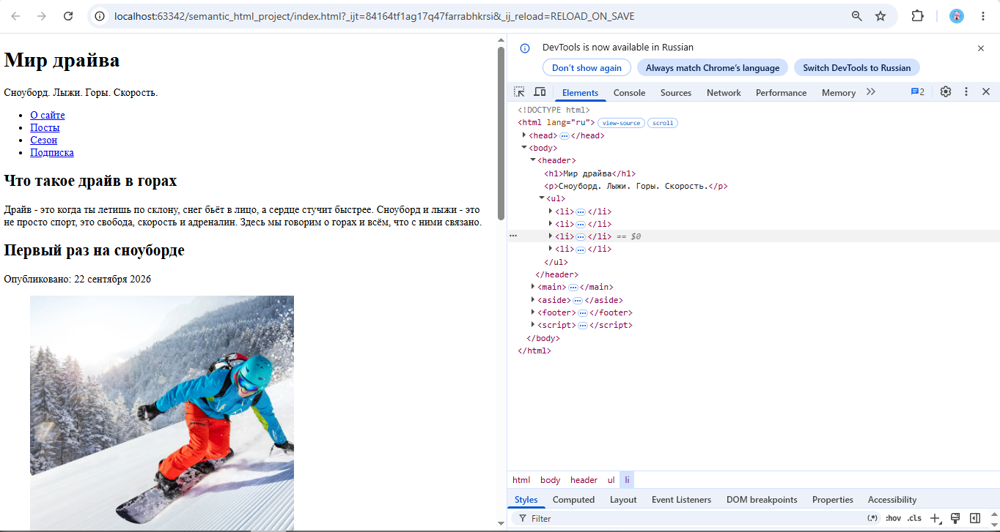

# Ответы на вопросы для самоконтроля

1. **Чем семантическая верстка отличается от несемантической и почему она важна?**
   Семантическая использует теги по смыслу (`<header>`, `<article>`, `<nav>`),
   несемантическая — только `
` и ``. Семантика важна для доступности,
   SEO и понятности кода.

2. **Когда использовать `<article>` вместо `<section>`?**
   `<article>` — самостоятельный блок (пост про первый раз на сноуборде,
   пост про выбор лыж или сноуборда). `<section>` — тематический раздел
   внутри страницы («О сайте», «Календарь сезона»).

3. **Для чего `<header>` и `<footer>`? Можно ли использовать несколько раз?**
   `<header>` — вводная часть (заголовок, логотип). `<footer>` — завершающая
   (автор, копирайт). Да, можно использовать несколько раз: у страницы и у каждого `<article>`.

4. **Какой тег для основного контента и почему не `
`?**
   `<main>` — обозначает главный уникальный контент. `
` не несёт смысла,
   поэтому скринридеры и поисковики не понимают, где основное содержимое.

5. **Разница между `<nav>` и обычным списком ссылок? Когда обязателен `<nav>`?**
   `<nav>` — семантический контейнер для навигации. Обычный `<ul>` — просто список.
   `<nav>` используют для главных навигационных блоков (меню).

6. **Зачем атрибут `datetime` в `<time>`?**
   Он задаёт машиночитаемый формат даты (`2026-09-20`), что важно для поисковиков
   и календарей.

7. **Преимущества `<figure>` и `<figcaption>` против `` с подписью?**
   Они семантически связывают картинку и подпись. Поисковики и скринридеры
   понимают, что подпись относится именно к этому изображению.

8. **Когда использовать `<aside>` и что туда класть?**
   Для контента, косвенно связанного с основным: боковые ссылки, цитаты, советы.
   У меня это «Полезное» и «Цитата недели».

9. **Как семантика влияет на SEO и доступность?**
   Поисковики лучше понимают структуру и тематику. Скринридеры корректно
   озвучивают навигацию и разделы.

10. **Какие теги я использовал для структуры и как они помогают?**
    `header`, `nav`, `main`, `section`, `article`, `aside`, `footer`, `figure`,
    `figcaption`, `time`, `table`, `form`. Они делают код понятным для людей
    и машин, помогают пользователям ориентироваться, а поисковикам — индексировать.